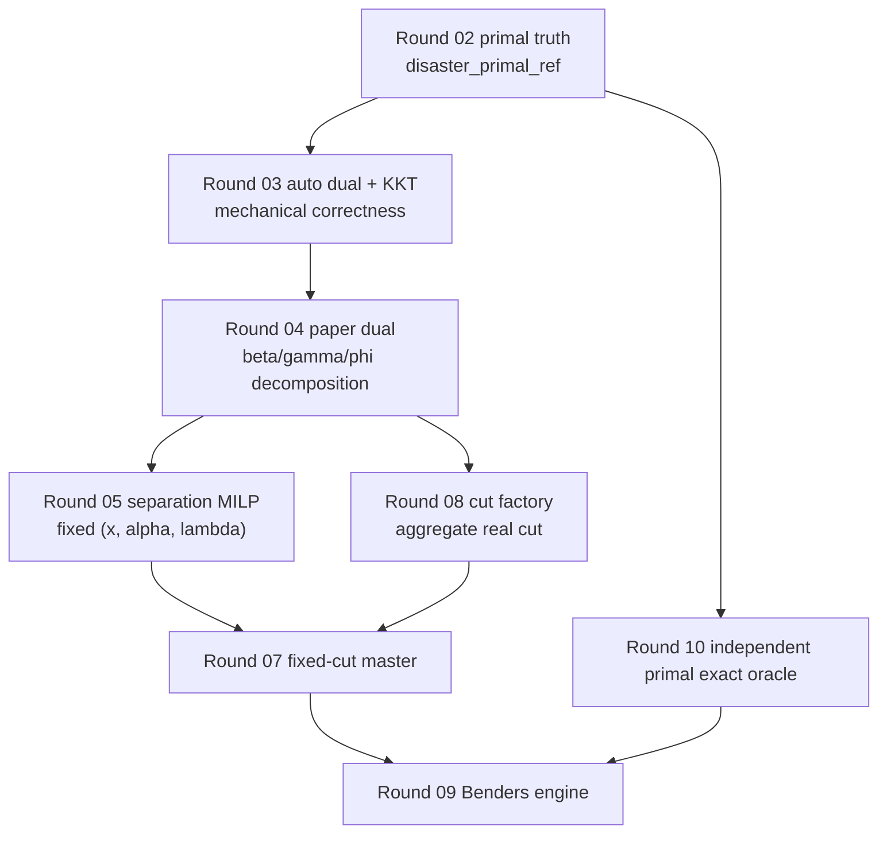

# 06. Bridge To Production And Benders

## 1. 这一阶段解决什么问题

前面的 tutorial 都偏 reference。

这一节回答的是：

- reference 数学链到底如何喂给 production 主线
- `beta / gamma / phi` 怎样变成 cut
- separation / master / Benders 各自消化 reference 的哪一段结果

这一步不是重新推导 production 方程，而是把“reference 的数学证据”和“production 的算法部件”桥接起来。

## 2. 它在整条链路中的位置

它的位置是：

`reference truth -> production reformulation -> cut generation -> iterative Benders`

也可以写成：

`primal truth -> dual decomposition -> separation oracle -> master cut -> Benders loop`

## 3. 对应的核心公式 / equation groups

这一节跨越多个 equation group：

- Eq. (36): aggregated cut coefficients
- Eq. (39): restricted master problem
- Eq. (40): `omega` bounds
- Eq. (41): linearized separation MILP
- Algorithm 1: cut generation and Benders iteration

代码归属：

- `src/production/separation_milp.py`
- `src/production/master_problem.py`
- `src/production/cut_factory.py`
- `src/production/benders_engine.py`

## 4. 对应的核心代码文件和主要 dataclass / builder / solver

核心文件：

- `src/production/separation_milp.py`
- `src/production/master_problem.py`
- `src/production/cut_factory.py`
- `src/production/benders_engine.py`

同时依赖：

- `src/production/disaster_dual_paper.py`
- `src/reference/outage_enumerator.py`
- `src/reference/dro_outer_lp_oracle.py`
- `src/reference/brute_force_stage1.py`

关键结构：

- `SamplewisePaperDualDecomposition`
- `RestrictedMasterCut`
- `SeparationMilpSolution`
- `BendersIterationRecord`

## 5. 输入是什么

从 reference 侧进入 production 的最核心输入有三个：

### 输入 1: samplewise `beta / gamma / phi`

这是 `src/production/disaster_dual_paper.py` 给出来的结构化 dual decomposition。

### 输入 2: outage-support oracle

`src/reference/outage_enumerator.py` 给出：

- `Omega(K)` 的稳定枚举
- budget-support 真值

它主要用来：

- tiny exactness验证
- `omega` 相关 bounded sanity check

### 输入 3: exact benchmark

`src/reference/brute_force_stage1.py` 给出 tiny end-to-end oracle，用来约束 Benders engine。

## 6. 输出是什么

production 侧主要输出：

### `separation_milp.py`

- fixed `(x, alpha, lambda)` 下的 violation
- `delta_star`
- samplewise dual block values

### `master_problem.py`

- fixed-cut restricted master solution
- first-stage plan
- `alpha`
- `lambda`

### `cut_factory.py`

- one structured cut
- 仍然保持：
  - `beta`
  - `gamma_z_by_bus`
  - `gamma_n_sl_by_bus`
  - `gamma_n_fa_by_bus`
  - `phi_by_line_id`

### `benders_engine.py`

- iteration trace
- lower-bound sequence
- cut-count sequence
- generated cuts
- certificate / stop reason

## 7. 这个阶段的结果如何被下一阶段使用

这一步其实已经是最接近完整主线的层次。

它的下游不是新的数学对象，而是：

- experiment packaging
- interpretation reports
- validation / readiness labeling

换句话说，如果你已经理解了这一节，后面的结果文件基本就是这些对象的导出和解释。

## 8. 对应 tests 在验证什么

关键 tests：

- `tests/oracle/test_separation_exactness.py`
- `tests/integration/test_single_iteration_cut_addition.py`
- `tests/integration/test_benders_vs_oracle.py`
- `tests/integration/test_epsilon_certificate.py`
- `tests/integration/test_benders_runtime_fixture_smoke.py`

它们分别在保护：

- separation 是否与 exact enumeration 一致
- generated cut 加回 master 后是否真的 tighten 了 envelope
- Benders 是否和 tiny brute-force optimum 一致
- epsilon certificate 是否按定义停止
- runtime-like 或 runtime smoke path 是否能跑通

## 9. 对应 round report 里最关键的结论是什么

这一节要同时看：

- `docs/reports/round_05_report.md`
- `docs/reports/round_07_report.md`
- `docs/reports/round_08_report.md`
- `docs/reports/round_09_report.md`

### Round 05: separation exactness

tiny cases 上观测到：

- generic case exactness gap `0.0`
- `phi-only` case exactness gap `0.0`
- blockwise reconstruction gap `0.0`

这说明 separation MILP 没有脱离 reference oracle。

### Round 07: fixed-cut master

master 已经可以消化 structured cuts，而不是黑盒向量。

### Round 08: generated cut efficacy

tiny generated-cut efficacy case里：

- old-master violation `100.0`
- objective `0.0 -> 10.0`
- post-cut residuals `0.0`

这说明生成出来的 real cut 不是摆设，而是真的会收紧 master。

### Round 09: full Benders loop

在 tiny exact regression 上：

- lower-bound trace: `(9.999999999999998, 70.0, 71.0)`
- cut-count trace: `(1, 2, 3)`
- final exact objective: `71.0`

这说明 cut accumulation 和 lower-bound bookkeeping 是健康的。

## 具体结果：single cut 为什么有用

Round 08 tiny case里，generated cut 的效果是：

- pre-cut master objective: `0.0`
- old-master cut violation: `100.0`
- post-cut master objective: `10.0`

这件事非常关键，因为它说明：

- separation 找到的 worst-case direction 不是虚的
- cut factory 组装的 `beta/gamma/phi` 没乱
- master 里的 `alpha / lambda / s / u` 结构真的把 cut 吃进去了

## 10. 读代码建议：先看哪里，再看哪里

建议顺序：

1. 先读 `src/production/separation_milp.py`
2. 再读 `src/production/master_problem.py`
3. 再读 `src/production/cut_factory.py`
4. 最后读 `src/production/benders_engine.py`

原因是：

- separation 先定义 violation
- master 先定义 cut 被加进去之后长什么样
- cut factory 再告诉你 cut 是怎么造出来的
- Benders engine 最后只是把这些块迭代起来

## 11. 这一阶段常见误解

### 误解 1

“Benders engine 才是主角，前面 reference 只是辅助。”

错。这个 repo 的设计是 reference 先把数学兜住，production 再建立算法主线。

### 误解 2

“cut factory 可以不管 samplewise dual decomposition，直接写闭式 cut。”

这会破坏当前 repo 最重要的可审计性。

### 误解 3

“runtime smoke 能跑通，就说明生产算法已经 fully validated。”

错。runtime smoke 只能说明链路通了，不代表 paper-scale correctness。

## 一张桥接图

