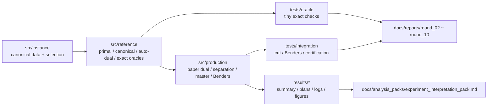

# `src/reference` Tutorial Pack

这套教程的目标不是“再复述一遍论文”，而是帮助你把这个 repo 里已经实现并验证过的数学链条读顺：

1. `src/reference` 里的 disaster primal 到底在建什么模型  
2. 为什么要先 canonicalize 再自动对偶  
3. paper dual 和 auto dual 的关系是什么  
4. outage enumeration 和 outer-DRO oracle 为什么单独存在  
5. 这些 reference 模块怎么桥接到 production 的 separation / master / Benders  
6. 现有 `docs/reports/*` 和 `results/*` 里，哪些结论是 exact，哪些只是 epsilon-certified 或 smoke-only

## 推荐阅读顺序

`00 -> 01 -> 02 -> 03 -> 04 -> 05 -> 06 -> 07 -> appendix`

- [00_repo_map_and_reading_strategy.md](./00_repo_map_and_reading_strategy.md)
- [01_disaster_primal_ref.md](./01_disaster_primal_ref.md)
- [02_canonicalizer_and_auto_dual.md](./02_canonicalizer_and_auto_dual.md)
- [03_paper_dual_and_beta_gamma_phi.md](./03_paper_dual_and_beta_gamma_phi.md)
- [04_outage_enumeration_and_outer_dro.md](./04_outage_enumeration_and_outer_dro.md)
- [05_tiny_exact_oracles_and_bruteforce.md](./05_tiny_exact_oracles_and_bruteforce.md)
- [06_bridge_to_production_and_benders.md](./06_bridge_to_production_and_benders.md)
- [07_reports_and_results_how_to_read.md](./07_reports_and_results_how_to_read.md)
- [appendix_glossary.md](./appendix_glossary.md)

## 这套教程的使用方式

- 如果你是第一次进这个 repo：
  - 先读 `00`
  - 然后从 `01` 到 `05` 顺着 reference 数学链往后读
  - 最后再读 `06` 和 `07`
- 如果你已经知道论文，但不知道代码：
  - 从 `01` 开始
  - 每读完一节都回到对应的 `src/reference/*.py` 看一遍 dataclass 和 builder
- 如果你是准备改算法：
  - 至少先读完 `02`、`03`、`04`、`06`
  - 因为 cut / separation / Benders 的正确性都靠这些桥接关系

## 一张总览图

## Validation Labels 一定要先记住

这个 repo 里最重要的元信息不是“结果数值有多大”，而是“这个结果的证据级别是什么”。

### `exact`

表示当前结论在这个受控问题上是 exact 的。

典型来源：

- toy oracle
- brute-force cross-check
- direct benchmark solve
- independent exact disaster oracle

### `epsilon_certified`

表示这个 Benders 结果不是 exact，但已经被显式 epsilon 证书兜住。

你应该把它理解成：

- 有误差上界
- 可以拿来做受控结论
- 但不要混同于 exact

### `smoke_only`

表示这个 run 主要证明：

- 代码链路能跑通
- 方向性上看起来合理
- 产物打包没有坏

它**不**表示：

- 论文级别最优
- 最终数值可靠复现
- 可以直接写进论文结论

## 这一轮 Tutorial 的边界

本教程重点讲：

- `src/reference/*.py`
- 它们如何支撑 `src/production/*.py`
- 对应 `docs/reports/round_02_report.md` 到 `docs/reports/round_10_report.md`
- 对应 `results/summary.csv` 与 `docs/analysis_packs/experiment_interpretation_pack.md`

本教程不重点讲：

- UI / 部署
- 原始论文全文翻译
- Gurobi 基础用法
- data package 的历史生成方式

## 当前结果的解释边界

结合当前 [results/summary.csv](/Users/shixinliu/Desktop/Research/GitHub_Research/two-regime-dro/two-regime-dro/results/summary.csv) 和 [docs/analysis_packs/experiment_interpretation_pack.md](/Users/shixinliu/Desktop/Research/GitHub_Research/two-regime-dro/two-regime-dro/docs/analysis_packs/experiment_interpretation_pack.md)，你需要先记住两条：

1. 当前 `runtime_12` 不是 paper-scale numerical reproduction  
2. 默认 `{1,2}` runtime family 里很多结论仍然只能按 `smoke_only` 解读

如果读 tutorial 时忘了这一点，后面很容易把“代码已经跑出来”误当成“论文数值已经复现”。
